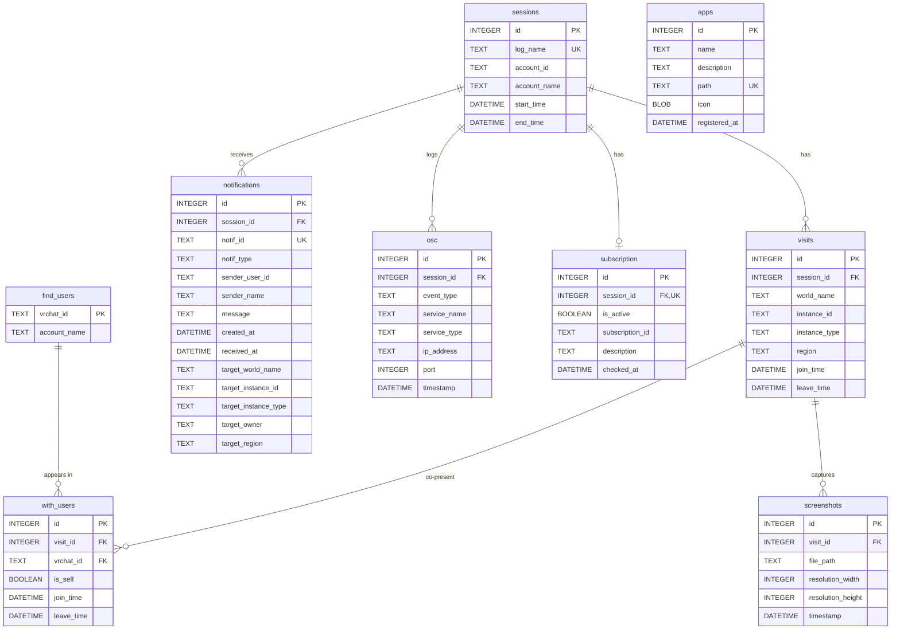

# Database Schema

> StellaRecord のメインデータベース (`Data/db/stellarecord.db`) のスキーマリファレンス。
> スキーマ定義の一次情報は `src-tauri/src/analyze/db.rs` の `MAIN_SCHEMA` / `MAIN_VIEWS` 定数。

## Table of Contents

- [Overview](#overview)
- [Conventions](#conventions)
- [ER Diagram](#er-diagram)
- [Tables](#tables)
  - [sessions](#sessions)
  - [visits](#visits)
  - [find_users](#find_users)
  - [with_users](#with_users)
  - [notifications](#notifications)
  - [screenshots](#screenshots)
  - [osc](#osc)
  - [subscription](#subscription)
  - [apps](#apps)
- [Views](#views)
  - [visit_summary](#visit_summary)
  - [with_users_detail](#with_users_detail)
  - [screenshots_detail](#screenshots_detail)
- [Indexes](#indexes)
- [Initialization and PRAGMA](#initialization-and-pragma)
- [Migrations](#migrations)
- [Backup and Restore](#backup-and-restore)
- [Performance Notes](#performance-notes)

---

## Overview

| Property | Value |
| -------- | ----- |
| Engine | SQLite 3 (via rusqlite 0.38, `bundled` feature) |
| Journal Mode | WAL (Write-Ahead Logging) |
| Foreign Keys | Enforced (`PRAGMA foreign_keys = ON`) |
| Tables | 9 |
| Views | 3 |
| Indexes | 10 (UNIQUE 制約による自動生成を除く) |
| Schema Definition | `src-tauri/src/analyze/db.rs` |

データベースは VRChat ログから抽出した正規化データを保管するメインドメインのテーブル群と、ランチャー機能で使用する `apps` テーブルで構成される。

---

## Conventions

### Naming

| Element | Convention | Example |
| ------- | ---------- | ------- |
| Table name | snake_case (複数形) | `sessions`, `visits` |
| Column name | snake_case | `account_name`, `join_time` |
| Primary key | `id INTEGER PRIMARY KEY AUTOINCREMENT` （`find_users` を除く） | - |
| Foreign key | `<table>_id INTEGER NOT NULL REFERENCES <table>(id)` | `session_id` |
| Timestamp | `DATETIME` 型、`'YYYY-MM-DD HH:MM:SS'` 文字列で保管 | `join_time` |
| Boolean | `BOOLEAN`（SQLite 内部は INTEGER 0/1） | `is_self`, `is_active` |
| Enum | `TEXT CHECK(col IN (...))` | `instance_type` |

### Type Mapping

SQLite はストレージクラスのみを持ち、宣言型は親和性ヒントとして機能する。本プロジェクトでは以下の対応で運用する。

| Declared Type | Storage Class | Rust Type |
| ------------- | ------------- | --------- |
| `INTEGER` | INTEGER | `i64`, `u32` |
| `TEXT` | TEXT | `String` |
| `DATETIME` | TEXT | `String`（`chrono::NaiveDateTime` でパース） |
| `BOOLEAN` | INTEGER | `bool` |
| `BLOB` | BLOB | `Vec<u8>` |

### Idempotency

再取り込みやエラー時の冪等性を保証するため、各テーブルで以下の戦略を採用する。

| Table | Idempotency Mechanism |
| ----- | --------------------- |
| `sessions` | `log_name UNIQUE` + `INSERT OR IGNORE` |
| `notifications` | `notif_id UNIQUE` + `INSERT OR IGNORE` |
| `with_users` | `UNIQUE(visit_id, vrchat_id)` + `INSERT OR IGNORE` |
| `find_users` | `vrchat_id PRIMARY KEY` + `ON CONFLICT DO UPDATE` (表示名最新化) |
| `subscription` | `session_id UNIQUE` + `INSERT OR IGNORE` |
| `apps` | `path UNIQUE` |

---

## ER Diagram



`apps` テーブルは VRChat ログとは独立しており、ランチャー機能で登録された外部 EXE のメタデータを保管する。

---

## Tables

### sessions

ログファイル単位のセッション情報。1 ログファイル = 1 セッション。

| Column | Type | Nullable | Default | Description |
| ------ | ---- | -------- | ------- | ----------- |
| `id` | INTEGER | NO | AUTOINCREMENT | プライマリキー |
| `log_name` | TEXT | NO | - | 元ログファイル名 (例: `output_log_2025-10-21_00-59-15.txt`) |
| `account_id` | TEXT | YES | NULL | 自分の VRChat ID (`usr_xxx`) |
| `account_name` | TEXT | YES | NULL | 自分の表示名 |
| `start_time` | DATETIME | YES | NULL | セッション開始時刻 |
| `end_time` | DATETIME | YES | NULL | セッション終了時刻 |

**Constraints**

- `PRIMARY KEY (id)`
- `UNIQUE (log_name)` — 再取り込み防止

---

### visits

ワールドインスタンスへの 1 回の訪問。`Joining` 行で INSERT、`OnLeftRoom` または次の `Entering Room` で `leave_time` を UPDATE する。

| Column | Type | Nullable | Default | Description |
| ------ | ---- | -------- | ------- | ----------- |
| `id` | INTEGER | NO | AUTOINCREMENT | プライマリキー |
| `session_id` | INTEGER | NO | - | 親セッション (`sessions.id`) |
| `world_name` | TEXT | NO | - | ワールド表示名 |
| `instance_id` | TEXT | NO | - | インスタンス番号 |
| `instance_type` | TEXT | YES | NULL | 公開区分 |
| `region` | TEXT | YES | NULL | サーバリージョン (`jp`, `use`, `usw`, `eu` 等) |
| `join_time` | DATETIME | NO | - | 入室時刻 |
| `leave_time` | DATETIME | YES | NULL | 退室時刻 (滞在中は NULL) |

**Constraints**

- `PRIMARY KEY (id)`
- `FOREIGN KEY (session_id) REFERENCES sessions(id)`
- `CHECK (instance_type IN ('private','friends','hidden','public','group') OR instance_type IS NULL)`

**Indexes**

- `idx_visits_join_time (join_time)` — DB プレビューのデフォルトソート
- `idx_visits_session_id (session_id)` — `visit_summary` ビューの集計用

---

### find_users

これまでに観測した VRChat ユーザーのカタログ。

| Column | Type | Nullable | Default | Description |
| ------ | ---- | -------- | ------- | ----------- |
| `vrchat_id` | TEXT | NO | - | VRChat ID (`usr_xxx`) |
| `account_name` | TEXT | NO | - | 最新観測の表示名 |

**Constraints**

- `PRIMARY KEY (vrchat_id)`

**Notes**

- INSERT 時は `ON CONFLICT(vrchat_id) DO UPDATE SET account_name = excluded.account_name` で表示名を最新化する。

---

### with_users

訪問単位の同席ユーザー記録。

| Column | Type | Nullable | Default | Description |
| ------ | ---- | -------- | ------- | ----------- |
| `id` | INTEGER | NO | AUTOINCREMENT | プライマリキー |
| `visit_id` | INTEGER | NO | - | 訪問 (`visits.id`) |
| `vrchat_id` | TEXT | NO | - | プレイヤー (`find_users.vrchat_id`) |
| `is_self` | BOOLEAN | NO | 0 | 自分自身か |
| `join_time` | DATETIME | NO | - | 観測開始時刻 |
| `leave_time` | DATETIME | YES | NULL | 観測終了時刻 |

**Constraints**

- `PRIMARY KEY (id)`
- `FOREIGN KEY (visit_id) REFERENCES visits(id)`
- `FOREIGN KEY (vrchat_id) REFERENCES find_users(vrchat_id)`
- `UNIQUE (visit_id, vrchat_id)` — 同訪問内の重複防止

**Indexes**

- `idx_with_users_visit_id (visit_id)`
- `idx_with_users_vrchat_id (vrchat_id)`

---

### notifications

VRChat の通知履歴。`is_collectible_notification()` でフィルタされた 5 種類のみを格納する。

| Column | Type | Nullable | Default | Description |
| ------ | ---- | -------- | ------- | ----------- |
| `id` | INTEGER | NO | AUTOINCREMENT | プライマリキー |
| `session_id` | INTEGER | NO | - | 受信セッション |
| `notif_id` | TEXT | YES | NULL | VRChat 側の通知 ID (`not_xxx`) |
| `notif_type` | TEXT | NO | - | 通知種別 |
| `sender_user_id` | TEXT | YES | NULL | 送信者の VRChat ID |
| `sender_name` | TEXT | YES | NULL | 送信者表示名 |
| `message` | TEXT | YES | NULL | 通知本文 |
| `created_at` | DATETIME | YES | NULL | 通知元での生成時刻 |
| `received_at` | DATETIME | NO | - | アプリでの観測時刻 |
| `target_world_name` | TEXT | YES | NULL | 招待先ワールド名 |
| `target_instance_id` | TEXT | YES | NULL | 招待先インスタンス ID |
| `target_instance_type` | TEXT | YES | NULL | 招待先公開区分 |
| `target_owner` | TEXT | YES | NULL | 招待先インスタンスオーナー |
| `target_region` | TEXT | YES | NULL | 招待先リージョン |

**Constraints**

- `PRIMARY KEY (id)`
- `FOREIGN KEY (session_id) REFERENCES sessions(id)`
- `UNIQUE (notif_id)`
- `CHECK (notif_type IN ('boop','friendRequest','requestInvite','invite','group'))`

**Indexes**

- `idx_notifications_type (notif_type)`
- `idx_notifications_received (received_at)`

---

### screenshots

VRChat Camera による撮影イベント。

| Column | Type | Nullable | Default | Description |
| ------ | ---- | -------- | ------- | ----------- |
| `id` | INTEGER | NO | AUTOINCREMENT | プライマリキー |
| `visit_id` | INTEGER | YES | NULL | 撮影時の訪問 (ワールド外撮影時は NULL) |
| `file_path` | TEXT | NO | - | 保存先フルパス |
| `resolution_width` | INTEGER | YES | NULL | 解像度幅 (px) |
| `resolution_height` | INTEGER | YES | NULL | 解像度高さ (px) |
| `timestamp` | DATETIME | NO | - | 撮影時刻 |

**Constraints**

- `PRIMARY KEY (id)`
- `FOREIGN KEY (visit_id) REFERENCES visits(id)`

**Indexes**

- `idx_screenshots_visit_id (visit_id)`
- `idx_screenshots_timestamp (timestamp)`

---

### osc

OSC サービス検出イベント。`Found new OSC Service: <name> at <ip>:<port>` 行から抽出する。

| Column | Type | Nullable | Default | Description |
| ------ | ---- | -------- | ------- | ----------- |
| `id` | INTEGER | NO | AUTOINCREMENT | プライマリキー |
| `session_id` | INTEGER | NO | - | 検出セッション |
| `event_type` | TEXT | NO | - | イベント種別 |
| `service_name` | TEXT | YES | NULL | サービス名 (例: `OyasumiVR`) |
| `service_type` | TEXT | YES | NULL | OSC / OSCQuery 区別 (現状は NULL 固定) |
| `ip_address` | TEXT | YES | NULL | 検出時の接続先 IP |
| `port` | INTEGER | YES | NULL | ポート番号 |
| `timestamp` | DATETIME | NO | - | 検出時刻 |

**Constraints**

- `PRIMARY KEY (id)`
- `FOREIGN KEY (session_id) REFERENCES sessions(id)`
- `CHECK (event_type IN ('found'))`

**Indexes**

- `idx_osc_session_id (session_id)`
- `idx_osc_timestamp (timestamp)`

---

### subscription

VRChat+ サブスクリプション状態。セッション開始時に 1 回出力される `Get VRChat Subscription Details!` 行から抽出する。

| Column | Type | Nullable | Default | Description |
| ------ | ---- | -------- | ------- | ----------- |
| `id` | INTEGER | NO | AUTOINCREMENT | プライマリキー |
| `session_id` | INTEGER | NO | - | 確認セッション |
| `is_active` | BOOLEAN | NO | - | VRChat+ 有効フラグ |
| `subscription_id` | TEXT | YES | NULL | VRChat 側の契約 ID |
| `description` | TEXT | YES | NULL | サブスクリプション種別説明 |
| `checked_at` | DATETIME | NO | - | 確認時刻 |

**Constraints**

- `PRIMARY KEY (id)`
- `FOREIGN KEY (session_id) REFERENCES sessions(id)`
- `UNIQUE (session_id)` — 1 セッション 1 レコード

---

### apps

ランチャーに登録された外部 EXE のメタデータ。VRChat ログとは独立した管理データ。

| Column | Type | Nullable | Default | Description |
| ------ | ---- | -------- | ------- | ----------- |
| `id` | INTEGER | NO | AUTOINCREMENT | プライマリキー |
| `name` | TEXT | NO | - | 表示名 |
| `description` | TEXT | NO | `''` | 説明文 |
| `path` | TEXT | NO | - | EXE のフルパス |
| `icon` | BLOB | YES | NULL | アイコン PNG バイナリ |
| `registered_at` | DATETIME | YES | `datetime('now', 'localtime')` | 登録時刻 |

**Constraints**

- `PRIMARY KEY (id)`
- `UNIQUE (path)` — 同一 EXE の重複登録防止

---

## Views

### visit_summary

各訪問の滞在秒数と他プレイヤー数を付与した派生ビュー。

```sql
CREATE VIEW visit_summary AS
SELECT
    v.id AS visit_id,
    v.world_name,
    v.instance_id,
    v.instance_type,
    v.region,
    v.join_time,
    v.leave_time,
    CAST(
      (julianday(COALESCE(v.leave_time, datetime('now'))) - julianday(v.join_time)) * 86400
      AS INTEGER
    ) AS duration_sec,
    (SELECT COUNT(*)
     FROM with_users wu
     WHERE wu.visit_id = v.id AND wu.is_self = 0) AS other_player_count
FROM visits v
ORDER BY v.join_time DESC;
```

| Column | Type | Description |
| ------ | ---- | ----------- |
| `visit_id` | INTEGER | `visits.id` |
| `world_name` | TEXT | ワールド名 |
| `instance_id` | TEXT | インスタンス ID |
| `instance_type` | TEXT | 公開区分 |
| `region` | TEXT | リージョン |
| `join_time` | DATETIME | 入室時刻 |
| `leave_time` | DATETIME | 退室時刻 |
| `duration_sec` | INTEGER | 滞在秒数 (`leave_time` が NULL の場合は現在時刻まで) |
| `other_player_count` | INTEGER | 自分を除いた同席プレイヤー数 |

---

### with_users_detail

`with_users` に `find_users` と `visits` を結合した詳細ビュー。

```sql
CREATE VIEW with_users_detail AS
SELECT
    wu.id,
    wu.visit_id,
    v.world_name,
    wu.vrchat_id,
    fu.account_name AS user_name,
    wu.is_self,
    wu.join_time,
    wu.leave_time
FROM with_users wu
JOIN find_users fu ON fu.vrchat_id = wu.vrchat_id
JOIN visits v ON v.id = wu.visit_id;
```

| Column | Type | Description |
| ------ | ---- | ----------- |
| `id` | INTEGER | `with_users.id` |
| `visit_id` | INTEGER | 訪問 ID |
| `world_name` | TEXT | ワールド名 |
| `vrchat_id` | TEXT | プレイヤー VRChat ID |
| `user_name` | TEXT | プレイヤー表示名 |
| `is_self` | BOOLEAN | 自分自身か |
| `join_time` | DATETIME | 観測開始時刻 |
| `leave_time` | DATETIME | 観測終了時刻 |

---

### screenshots_detail

`screenshots` に `visits` を LEFT JOIN した詳細ビュー（ワールド外撮影に対応するため LEFT JOIN）。

```sql
CREATE VIEW screenshots_detail AS
SELECT
    s.id,
    s.visit_id,
    v.world_name,
    s.file_path,
    s.resolution_width,
    s.resolution_height,
    s.timestamp
FROM screenshots s
LEFT JOIN visits v ON v.id = s.visit_id;
```

| Column | Type | Description |
| ------ | ---- | ----------- |
| `id` | INTEGER | `screenshots.id` |
| `visit_id` | INTEGER | 訪問 ID (NULL 可) |
| `world_name` | TEXT | ワールド名 (ワールド外撮影は NULL) |
| `file_path` | TEXT | 保存先フルパス |
| `resolution_width` | INTEGER | 解像度幅 |
| `resolution_height` | INTEGER | 解像度高さ |
| `timestamp` | DATETIME | 撮影時刻 |

---

## Indexes

UNIQUE 制約による自動生成インデックスを除く、明示的に作成されるインデックス一覧。

| Index | Table | Columns | Purpose |
| ----- | ----- | ------- | ------- |
| `idx_visits_join_time` | `visits` | `join_time` | DB プレビューのデフォルトソート |
| `idx_visits_session_id` | `visits` | `session_id` | `visit_summary` ビューの JOIN |
| `idx_with_users_visit_id` | `with_users` | `visit_id` | `with_users_detail` ビューの JOIN |
| `idx_with_users_vrchat_id` | `with_users` | `vrchat_id` | プレイヤー単位検索 |
| `idx_notifications_type` | `notifications` | `notif_type` | 通知種別フィルタ |
| `idx_notifications_received` | `notifications` | `received_at` | 時系列ソート |
| `idx_screenshots_visit_id` | `screenshots` | `visit_id` | `screenshots_detail` ビューの JOIN |
| `idx_screenshots_timestamp` | `screenshots` | `timestamp` | 時系列ソート |
| `idx_osc_session_id` | `osc` | `session_id` | セッション JOIN |
| `idx_osc_timestamp` | `osc` | `timestamp` | 時系列ソート |

---

## Initialization and PRAGMA

`src-tauri/src/analyze/db.rs::init_main_db` がアプリ起動時と取り込み開始時に必ず実行される。

```rust
pub fn init_main_db(conn: &Connection) -> Result<()> {
    conn.execute_batch("PRAGMA journal_mode = WAL;")?;
    conn.execute_batch("PRAGMA foreign_keys = ON;")?;
    conn.execute_batch(MAIN_SCHEMA)?;          // CREATE TABLE IF NOT EXISTS
    conn.execute_batch(MAIN_VIEWS)?;           // CREATE VIEW IF NOT EXISTS
    migrate_apps_unique_to_path(conn)?;
    drop_legacy_apps_category(conn)?;
    Ok(())
}
```

### Active PRAGMAs

| PRAGMA | Value | Reason |
| ------ | ----- | ------ |
| `journal_mode` | `WAL` | 取り込み中（書き込み）と読み取り（ビューア・DB プレビュー）の並行動作 |
| `foreign_keys` | `ON` | REFERENCES 制約の実行時チェック (デフォルト OFF) |

---

## Migrations

スキーマ変更履歴と適用される migration 関数。

| Order | Function | Purpose |
| ----- | -------- | ------- |
| 1 | `MAIN_SCHEMA` execute | 全テーブルの `CREATE TABLE IF NOT EXISTS` |
| 2 | `MAIN_VIEWS` execute | 全ビューの `CREATE VIEW IF NOT EXISTS` |
| 3 | `migrate_apps_unique_to_path` | 旧スキーマで `apps.name UNIQUE` だった DB を `apps.path UNIQUE` に変更 |
| 4 | `drop_legacy_apps_category` | 旧 `apps.category` 列が残っていれば DROP COLUMN |

### `migrate_apps_unique_to_path`

旧スキーマでは `apps.name` が UNIQUE だったが、同一 EXE を別名で複数登録できるよう `apps.path` を UNIQUE に変更した。テーブル再作成パターンで移行する。

```sql
BEGIN;
CREATE TABLE apps_new (
    id INTEGER PRIMARY KEY AUTOINCREMENT,
    name TEXT NOT NULL,
    description TEXT NOT NULL DEFAULT '',
    path TEXT NOT NULL UNIQUE,
    icon BLOB,
    registered_at DATETIME DEFAULT (datetime('now', 'localtime'))
);
INSERT OR IGNORE INTO apps_new (id, name, description, path, icon, registered_at)
    SELECT id, name, description, path, icon, registered_at FROM apps;
DROP TABLE apps;
ALTER TABLE apps_new RENAME TO apps;
COMMIT;
```

> **注意**: `INSERT OR IGNORE` を使用しているため、旧 DB で `path` が重複していたレコード（理論上ない）はサイレントにドロップされる。

### `drop_legacy_apps_category`

旧スキーマの `apps.category` 列を削除する。`pragma_table_info` で列の存在を確認した上で `ALTER TABLE ... DROP COLUMN` を発行する。新規 DB では何も実行されない。

### Migration Strategy

現状はマイグレーションが 2 件のみのため `refinery` 等のバージョン管理ツールは導入していない。マイグレーションが 10 件を超える場合は導入を検討する。

---

## Backup and Restore

### Backup

`Data/db/` ディレクトリ全体をコピーすることでバックアップが可能。WAL モードのため、コピー時は以下の 3 ファイルを同時にコピーする必要がある。

| File | Description |
| ---- | ----------- |
| `stellarecord.db` | メイン DB ファイル |
| `stellarecord.db-wal` | Write-Ahead Log |
| `stellarecord.db-shm` | 共有メモリインデックス |

アプリ終了時に WAL は自動 checkpoint されるため、終了後であれば `stellarecord.db` のみのコピーでも一貫性が保たれる。

### Restore

別 PC への移行時は `Data/` ディレクトリ全体（`archive/` `db/` `logs/`）をコピーする。レジストリ設定はコピーされないため、容量上限などは再設定が必要。

### External Tools

DB ファイルは標準的な SQLite 3 形式のため、以下のツールで直接読み出し可能。

- [`sqlite3`](https://sqlite.org/cli.html) CLI
- [DB Browser for SQLite](https://sqlitebrowser.org/)
- VSCode の SQLite 拡張機能

---

## Performance Notes

### Write Performance

- 取り込み処理は外側トランザクション内で全アーカイブをまとめて commit する。途中の `analyze-progress` イベントは未 commit 状態で送出される。
- ファイル単位の savepoint で部分失敗を許容する設計のため、savepoint 開始/commit のオーバーヘッドが発生するが、典型的な 100 ファイル程度では実測 1 秒未満。

### Read Performance

- DB プレビューは `LIMIT 500 OFFSET ?` で 1 ページずつ取得する。OFFSET が大きくなるとスキャンコストが増えるが、UI 上のページ数は通常数百ページ以下のため問題にならない。
- ビュー (`visit_summary`, `with_users_detail`) は実体化されておらず、毎回サブクエリ／JOIN が走る。レコード数が増えると遅くなる場合は `INDEXED VIEW` 相当のキャッシュテーブルを検討する。

### Storage

- DB ファイルサイズは 1 セッション約 10〜100 KB（訪問数・通知数による）。
- 1000 セッション保管時の DB サイズはおおよそ 50〜200 MB の範囲。
- VACUUM は自動実行しない (`auto_vacuum = NONE`)。長期運用で削除が発生した場合のみ手動 VACUUM を検討する。
