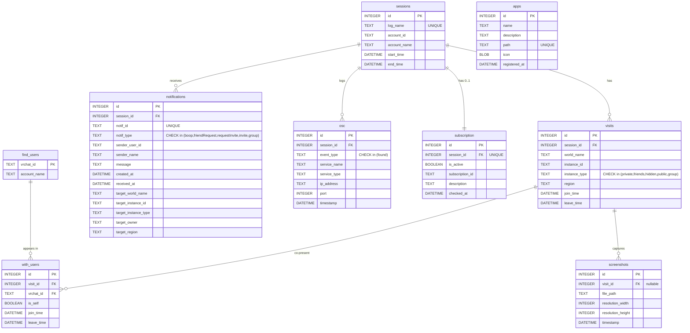

# STELLA RECORD データベース定義書

> 対象 DB: `Data/db/stellarecord.db`（SQLite 3, WAL モード, `foreign_keys = ON`）
> スキーマ定義の一次情報は `src-tauri/src/analyze/db.rs` の `MAIN_SCHEMA` / `MAIN_VIEWS` 定数。

---

## 目次

1. [ER 図](#1-er-図)
2. [テーブル一覧](#2-テーブル一覧)
3. [テーブル詳細](#3-テーブル詳細)
4. [ビュー詳細](#4-ビュー詳細)
5. [初期化とマイグレーション](#5-初期化とマイグレーション)
6. [運用上の注意](#6-運用上の注意)

---

## 1. ER 図



> `apps` テーブルは VRChat ログとは独立した、ランチャー機能用の登録アプリストア。

---

## 2. テーブル一覧

### テーブル

| 物理名 | 論理名 | 用途 | デフォルトソート |
|---|---|---|---|
| `sessions` | セッション | ログファイル（= ログイン～ログアウト 1 回分） | `start_time DESC` |
| `visits` | Join 履歴 | ワールドインスタンスへの 1 回の訪問 | `join_time DESC` |
| `find_users` | ユーザー一覧 | これまでに観測した VRChat ユーザーのカタログ | - |
| `with_users` | 遭遇ユーザー | 訪問単位の同席ユーザー記録 | `join_time DESC` |
| `notifications` | 通知 | 招待・boop・グループ通知などの履歴 | `received_at DESC` |
| `screenshots` | 写真 | `[VRC Camera] Took screenshot to:` の撮影イベント | `timestamp DESC` |
| `osc` | OSC | `Found new OSC Service:` の検出イベント | `timestamp DESC` |
| `subscription` | VRChat+加入状態 | セッション開始時の VRChat+ 状態 | `checked_at DESC` |
| `apps` | 連携アプリ | ランチャー登録アプリ（VRChat ログとは独立） | - |

### ビュー

| 物理名 | 論理名 | 元テーブル |
|---|---|---|
| `visit_summary` | Join 履歴詳細 | `visits` + 同席人数集計 + 滞在秒数算出 |
| `with_users_detail` | 遭遇ユーザー詳細 | `with_users` + `find_users` + `visits` 結合 |
| `screenshots_detail` | 写真詳細 | `screenshots` + `visits` 結合（LEFT JOIN） |

---

## 3. テーブル詳細

### 3.1 sessions

ログファイル 1 つ＝1 セッション。`log_name` の UNIQUE 制約で重複取り込みを防止。

| カラム | 型 | NULL | キー | 説明 |
|---|---|---|---|---|
| `id` | INTEGER | NOT NULL | PK (AUTOINCREMENT) | 内部 ID |
| `log_name` | TEXT | NOT NULL | UNIQUE | 元ログのファイル名（例: `output_log_2025-10-21_00-59-15.txt`） |
| `account_id` | TEXT | NULL | | 自分の VRChat `usr_xxx` |
| `account_name` | TEXT | NULL | | ログ時点の自分の表示名 |
| `start_time` | DATETIME | NULL | | 最初のタイムスタンプ行から推定 |
| `end_time` | DATETIME | NULL | | 最後のタイムスタンプ行から推定 |

### 3.2 visits

ワールド／インスタンスへの 1 回の訪問。`Joining ...` 行で INSERT、`Entering Room` の前または `OnLeftRoom` で `leave_time` を UPDATE。

| カラム | 型 | NULL | キー | 説明 |
|---|---|---|---|---|
| `id` | INTEGER | NOT NULL | PK (AUTOINCREMENT) | 内部 ID |
| `session_id` | INTEGER | NOT NULL | FK → `sessions(id)` | 親セッション |
| `world_name` | TEXT | NOT NULL | | ワールド表示名 |
| `instance_id` | TEXT | NOT NULL | | インスタンス番号 |
| `instance_type` | TEXT | NULL | CHECK | `private` / `friends` / `hidden` / `public` / `group` |
| `region` | TEXT | NULL | | `jp` / `use` / `usw` / `eu` 等 |
| `join_time` | DATETIME | NOT NULL | | 入室時刻 |
| `leave_time` | DATETIME | NULL | | 退室時刻（未確定なら NULL） |

**インデックス**: `idx_visits_join_time(join_time)`, `idx_visits_session_id(session_id)`

### 3.3 find_users

これまでに観測した VRChat ユーザーのカタログ。`vrchat_id` 重複時は表示名を最新値で上書きする（`ON CONFLICT DO UPDATE`）。

| カラム | 型 | NULL | キー | 説明 |
|---|---|---|---|---|
| `vrchat_id` | TEXT | NOT NULL | PK | `usr_xxx` 形式の VRChat ID |
| `account_name` | TEXT | NOT NULL | | 最新観測の表示名 |

### 3.4 with_users

訪問単位の同席記録。`UNIQUE(visit_id, vrchat_id)` で同訪問内重複を防止。`is_self=1` が自分自身の入室レコード。

| カラム | 型 | NULL | キー | 説明 |
|---|---|---|---|---|
| `id` | INTEGER | NOT NULL | PK (AUTOINCREMENT) | 内部 ID |
| `visit_id` | INTEGER | NOT NULL | FK → `visits(id)` | どの訪問内の記録か |
| `vrchat_id` | TEXT | NOT NULL | FK → `find_users(vrchat_id)` | プレイヤーの VRChat ID |
| `is_self` | BOOLEAN | NOT NULL DEFAULT 0 | | 自分自身か |
| `join_time` | DATETIME | NOT NULL | | 観測開始時刻 |
| `leave_time` | DATETIME | NULL | | 観測終了時刻 |

**インデックス**: `idx_with_users_visit_id(visit_id)`, `idx_with_users_vrchat_id(vrchat_id)`

### 3.5 notifications

通知履歴。`notif_id` の UNIQUE で再取り込み時の重複を吸収。`notif_type` は `is_collectible_notification()` でフィルタされた 5 種類のみを格納する。

| カラム | 型 | NULL | キー | 説明 |
|---|---|---|---|---|
| `id` | INTEGER | NOT NULL | PK (AUTOINCREMENT) | 内部 ID |
| `session_id` | INTEGER | NOT NULL | FK → `sessions(id)` | 受信時のセッション |
| `notif_id` | TEXT | NULL | UNIQUE | VRChat 側の `not_xxx` 識別子 |
| `notif_type` | TEXT | NOT NULL | CHECK | `boop` / `friendRequest` / `requestInvite` / `invite` / `group` |
| `sender_user_id` | TEXT | NULL | | 送信者の `usr_xxx` |
| `sender_name` | TEXT | NULL | | 送信者表示名 |
| `message` | TEXT | NULL | | 本文 |
| `created_at` | DATETIME | NULL | | 通知側で生成された時刻 |
| `received_at` | DATETIME | NOT NULL | | STELLA RECORD 観測時刻 |
| `target_world_name` | TEXT | NULL | | 招待先ワールド名 |
| `target_instance_id` | TEXT | NULL | | 招待先インスタンス ID |
| `target_instance_type` | TEXT | NULL | | 招待先公開区分 |
| `target_owner` | TEXT | NULL | | 招待先インスタンスオーナー |
| `target_region` | TEXT | NULL | | 招待先リージョン |

**インデックス**: `idx_notifications_type(notif_type)`, `idx_notifications_received(received_at)`

### 3.6 screenshots

VRChat Camera による撮影イベント。`visit_id` は NULL 許容（ワールド外撮影のため）。

| カラム | 型 | NULL | キー | 説明 |
|---|---|---|---|---|
| `id` | INTEGER | NOT NULL | PK (AUTOINCREMENT) | 内部 ID |
| `visit_id` | INTEGER | NULL | FK → `visits(id)` | 撮影時の訪問（不明なら NULL） |
| `file_path` | TEXT | NOT NULL | | 撮影ファイルのフルパス |
| `resolution_width` | INTEGER | NULL | | 幅（px） |
| `resolution_height` | INTEGER | NULL | | 高さ（px） |
| `timestamp` | DATETIME | NOT NULL | | 撮影時刻 |

**インデックス**: `idx_screenshots_visit_id(visit_id)`, `idx_screenshots_timestamp(timestamp)`

### 3.7 osc

`Found new OSC Service: <name> at <ip>:<port>` の検出イベント。OyasumiVR などの外部 OSC ツール検出に対応。

| カラム | 型 | NULL | キー | 説明 |
|---|---|---|---|---|
| `id` | INTEGER | NOT NULL | PK (AUTOINCREMENT) | 内部 ID |
| `session_id` | INTEGER | NOT NULL | FK → `sessions(id)` | 検出セッション |
| `event_type` | TEXT | NOT NULL | CHECK = `found` | 現状 `found` のみ |
| `service_name` | TEXT | NULL | | サービス名 |
| `service_type` | TEXT | NULL | | OSC / OSCQuery 区別（現状は NULL） |
| `ip_address` | TEXT | NULL | | 検出時の接続先 IP |
| `port` | INTEGER | NULL | | ポート番号 |
| `timestamp` | DATETIME | NOT NULL | | 検出時刻 |

**インデックス**: `idx_osc_session_id(session_id)`, `idx_osc_timestamp(timestamp)`

### 3.8 subscription

VRChat+ サブスクリプション状態。`session_id UNIQUE` で 1 セッション 1 レコード。

| カラム | 型 | NULL | キー | 説明 |
|---|---|---|---|---|
| `id` | INTEGER | NOT NULL | PK (AUTOINCREMENT) | 内部 ID |
| `session_id` | INTEGER | NOT NULL | FK → `sessions(id)`, UNIQUE | 1 セッション 1 レコード |
| `is_active` | BOOLEAN | NOT NULL | | VRChat+ が有効か |
| `subscription_id` | TEXT | NULL | | VRChat 側の契約識別子（無効なら NULL） |
| `description` | TEXT | NULL | | サブスクリプション種別説明 |
| `checked_at` | DATETIME | NOT NULL | | 確認時刻 |

### 3.9 apps

ランチャーに登録されたアプリ。VRChat ログとは独立。アイコンは PNG バイナリを BLOB 直接格納。

| カラム | 型 | NULL | キー | 説明 |
|---|---|---|---|---|
| `id` | INTEGER | NOT NULL | PK (AUTOINCREMENT) | 内部 ID |
| `name` | TEXT | NOT NULL | | 表示名 |
| `description` | TEXT | NOT NULL DEFAULT '' | | 説明文 |
| `path` | TEXT | NOT NULL | UNIQUE | 実行ファイルのフルパス |
| `icon` | BLOB | NULL | | アイコン PNG（256×256 推奨） |
| `registered_at` | DATETIME | DEFAULT `datetime('now','localtime')` | | 登録時刻 |

---

## 4. ビュー詳細

### 4.1 visit_summary

「Join 履歴詳細」。`visits` に滞在秒数（`duration_sec`）と他プレイヤー数（`other_player_count`）を付与した派生ビュー。

```sql
CREATE VIEW visit_summary AS
SELECT
    v.id AS visit_id,
    v.world_name, v.instance_id, v.instance_type, v.region,
    v.join_time, v.leave_time,
    CAST((julianday(COALESCE(v.leave_time, datetime('now'))) - julianday(v.join_time)) * 86400 AS INTEGER) AS duration_sec,
    (SELECT COUNT(*) FROM with_users wu WHERE wu.visit_id = v.id AND wu.is_self = 0) AS other_player_count
FROM visits v
ORDER BY v.join_time DESC;
```

| カラム | 補足 |
|---|---|
| `duration_sec` | `leave_time` が NULL の場合は現在時刻を使用 |
| `other_player_count` | 自分（`is_self=1`）を除いた同席数 |

### 4.2 with_users_detail

「遭遇ユーザー詳細」。`with_users` に `find_users.account_name` と `visits.world_name` を結合した可読ビュー。

```sql
CREATE VIEW with_users_detail AS
SELECT
    wu.id, wu.visit_id, v.world_name,
    wu.vrchat_id, fu.account_name AS user_name, wu.is_self,
    wu.join_time, wu.leave_time
FROM with_users wu
JOIN find_users fu ON fu.vrchat_id = wu.vrchat_id
JOIN visits v ON v.id = wu.visit_id;
```

### 4.3 screenshots_detail

「写真詳細」。`screenshots` に `visits.world_name` を LEFT JOIN（ワールド外撮影に対応するため）。

```sql
CREATE VIEW screenshots_detail AS
SELECT
    s.id, s.visit_id, v.world_name,
    s.file_path, s.resolution_width, s.resolution_height, s.timestamp
FROM screenshots s
LEFT JOIN visits v ON v.id = s.visit_id;
```

---

## 5. 初期化とマイグレーション

`src-tauri/src/analyze/db.rs::init_main_db` がアプリ起動時と取り込み開始時に必ず呼ばれる。

実行順序：

1. `PRAGMA journal_mode = WAL`
2. `PRAGMA foreign_keys = ON`
3. `MAIN_SCHEMA` の `CREATE TABLE IF NOT EXISTS` 群
4. `MAIN_VIEWS` の `CREATE VIEW IF NOT EXISTS` 群
5. `migrate_apps_unique_to_path()` — 旧スキーマで `apps.name UNIQUE` だった DB を `apps.path UNIQUE` に移行
6. `drop_legacy_apps_category()` — `apps.category` 列が残っていれば DROP COLUMN

旧 DB との互換性は維持されるが、`migrate_apps_unique_to_path` は `INSERT OR IGNORE` で重複 path をドロップする実装のため、同一 EXE を複数登録していた旧 DB では重複行が失われる点に留意。

---

## 6. 運用上の注意

| 項目 | 内容 |
|---|---|
| 同時アクセス | WAL モード + アプリレベルの UI ガード（`isAnalyzeRunning`）で複数取り込みを排他制御 |
| バックアップ | アンインストール時も `Data/archive/` `Data/db/` は NSIS が保護対象として残す |
| サイズ | アーカイブストアが警告ライン（デフォルト 300 MB）を超えると UI のメーターが赤に変化 |
| BLOB の肥大化 | `apps.icon` は 256×256 PNG 想定（通常 50KB 以下）。大量登録時は注意 |
| 削除 | 元ログ（`output_log_*.txt`）は `delete_source_logs` で削除可能。アーカイブの存在を確認してから削除する設計 |
| 整合性 | `FOREIGN KEYS = ON` のため、`sessions` を直接削除すると子レコードが制約違反になる。削除はトランザクション内で子から順に行うこと（現アプリには手動削除 UI はない） |
