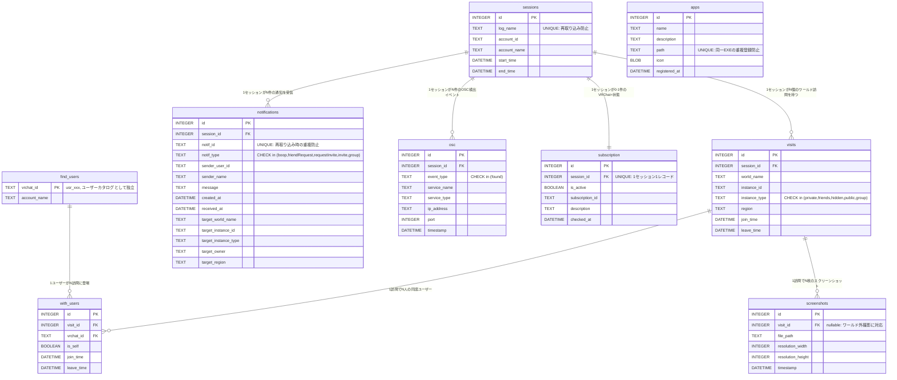

# データベース設計書 — スキーマと設計判断

> 本書はポートフォリオ用に、STELLA RECORD の DB 設計を**「なぜこのスキーマか」「なぜこのインデックスか」「なぜこの正規化レベルか」**の観点で説明する。
> 単なるテーブル定義の羅列ではなく、設計者の意思決定が読み取れるよう構成している。

---

## 目次

1. [全体設計方針](#1-全体設計方針)
2. [ER 図と関係性](#2-er-図と関係性)
3. [テーブル設計の意図](#3-テーブル設計の意図)
4. [インデックス選定](#4-インデックス選定)
5. [ビュー設計](#5-ビュー設計)
6. [トランザクション戦略](#6-トランザクション戦略)
7. [マイグレーション戦略](#7-マイグレーション戦略)
8. [運用上のトレードオフ](#8-運用上のトレードオフ)

---

## 1. 全体設計方針

### 設計原則

| 原則 | 意図 |
|---|---|
| **第 3 正規形を基準、必要に応じて派生ビューで非正規化** | 書き込み時の冗長性を排除しつつ、読み取りはビュー経由で利便性確保 |
| **冪等性は UNIQUE 制約で保証** | 再取り込みしてもデータが重複しない |
| **時刻は DATETIME 文字列で統一** | SQLite に DATE 型はないため `YYYY-MM-DD HH:MM:SS` で正規化 |
| **CHECK 制約で列挙型を表現** | アプリケーション層に頼らずスキーマで値域を縛る |
| **削除は CASCADE しない** | FK 違反を意図的にエラーにし、誤って親レコードを削除する事故を防ぐ |

### 採用しなかった選択肢

| 不採用 | 理由 |
|---|---|
| ORM (Diesel / SeaORM) | スキーマが小規模で生 SQL の方が読みやすい。ビルド時間も短縮 |
| マイクロサービス的な分割 DB | パーソナルツールで集約 DB の方が JOIN コストが低い |
| NoSQL (lmdb / sled) | 関係性 (visits ←→ with_users ←→ find_users) が中心で RDBMS が自然 |
| Migration ツール (refinery 等) | 現状は 2 つのアドホック migration のみで導入コスト過多 |

---

## 2. ER 図と関係性



### 主要な関係性の判断

#### `sessions → visits` (1:N)

セッション = ログファイル 1 つ。1 つのセッション内で複数のワールド訪問が発生するため 1:N。

#### `find_users` を独立テーブルとした理由

最初は `with_users` に `account_name` 列を直接持たせる案もあったが、以下の理由で **find_users をユーザーカタログとして独立**させた：

| 課題 | find_users 独立による解決 |
|---|---|
| ユーザーが表示名を変更した場合 | `find_users.account_name` を 1 行 UPDATE するだけで全訪問の表示名が更新される |
| 「初めて会った日」を出したい | `with_users` から `MIN(join_time) GROUP BY vrchat_id` で集計可能 |
| 過去の表示名履歴を将来追加する余地 | `find_users` に history テーブルを追加すれば対応可能 |

#### `visits ←→ with_users` の中間テーブル設計

VRChat ログでは「**プレイヤー A がワールド X に滞在中の途中で離脱**」が頻繁に起きる。これを正確に記録するため：

- `with_users.join_time` / `leave_time` を**プレイヤーごと**に持つ
- 1 訪問内に同じプレイヤーが**入退室を繰り返す**ことは VRChat 仕様上ない（再入室は別 visit になる）ため `UNIQUE(visit_id, vrchat_id)` で十分

---

## 3. テーブル設計の意図

### 3.1 sessions

```sql
CREATE TABLE sessions (
    id              INTEGER PRIMARY KEY AUTOINCREMENT,
    log_name        TEXT UNIQUE NOT NULL,      -- ← 冪等性のキー
    account_id      TEXT,
    account_name    TEXT,
    start_time      DATETIME,
    end_time        DATETIME
);
```

**設計判断**:

- `log_name UNIQUE`: 取り込み済みファイルの再取り込みを `INSERT OR IGNORE` で吸収する基盤
- `account_id` / `account_name` を nullable に: 認証行 `User Authenticated: ...` が出る前にログが終わるケース（クラッシュ等）を許容
- `start_time` / `end_time` を nullable に: ログが空の場合や時刻パース失敗時にも sessions 行は生成する（後段の parse_and_import が visits を作れるように）

### 3.2 visits

```sql
CREATE TABLE visits (
    id              INTEGER PRIMARY KEY AUTOINCREMENT,
    session_id      INTEGER NOT NULL REFERENCES sessions(id),
    world_name      TEXT NOT NULL,
    instance_id     TEXT NOT NULL,
    instance_type   TEXT CHECK(
        instance_type IN ('private','friends','hidden','public','group')
        OR instance_type IS NULL
    ),
    region          TEXT,
    join_time       DATETIME NOT NULL,
    leave_time      DATETIME
);
```

**設計判断**:

- `instance_type` の CHECK 制約: アプリケーション層のバグでスキーマ違反な値が入る事故を防止。`NULL` 許容は古いログ形式への後方互換
- `leave_time` nullable: VRChat クラッシュで `OnLeftRoom` が出ないケース（取り込み時点で滞在中扱い）
- `world_name TEXT NOT NULL`: `Entering Room: <name>` が必ず先行する設計のため
- `(world_name, instance_id)` の複合 UNIQUE は**敢えて作らない**: 同じインスタンスへの再訪問は別レコードとして記録すべきため

### 3.3 find_users / with_users

```sql
CREATE TABLE find_users (
    vrchat_id    TEXT PRIMARY KEY,    -- usr_xxx 自体を PK にする
    account_name TEXT NOT NULL
);

CREATE TABLE with_users (
    id           INTEGER PRIMARY KEY AUTOINCREMENT,
    visit_id     INTEGER NOT NULL REFERENCES visits(id),
    vrchat_id    TEXT NOT NULL REFERENCES find_users(vrchat_id),
    is_self      BOOLEAN NOT NULL DEFAULT 0,
    join_time    DATETIME NOT NULL,
    leave_time   DATETIME,
    UNIQUE(visit_id, vrchat_id)        -- ← 同訪問内重複防止
);
```

**設計判断**:

- `find_users.vrchat_id` を PK に: VRChat ID は不変な永続識別子なので INTEGER 代理キーは不要
- 取り込み時のクエリは `INSERT INTO find_users ... ON CONFLICT(vrchat_id) DO UPDATE SET account_name = excluded.account_name` で**表示名を最新化**
- `with_users.UNIQUE(visit_id, vrchat_id)`: ログ内の `OnPlayerJoined` 重複出現に備える防衛策

### 3.4 notifications

```sql
CREATE TABLE notifications (
    id                    INTEGER PRIMARY KEY AUTOINCREMENT,
    session_id            INTEGER NOT NULL REFERENCES sessions(id),
    notif_id              TEXT UNIQUE,
    notif_type            TEXT NOT NULL CHECK(
        notif_type IN ('boop','friendRequest','requestInvite','invite','group')
    ),
    sender_user_id        TEXT,
    sender_name           TEXT,
    message               TEXT,
    created_at            DATETIME,
    received_at           DATETIME NOT NULL,
    target_world_name     TEXT,
    target_instance_id    TEXT,
    target_instance_type  TEXT,
    target_owner          TEXT,
    target_region         TEXT
);
```

**設計判断**:

- `notif_id UNIQUE`: VRChat 通知の一意 ID `not_xxx` を保持。再取り込み時の重複を `INSERT OR IGNORE` で吸収
- `notif_type` を 5 種類に限定: パーサ側で `is_collectible_notification()` フィルタを通すため、それ以外（オンラインステータス変更など）は DB に入れない（ノイズ削減）
- `target_*` 列が 5 つ: 招待通知に含まれる `worldId=wrld_xxx,worldName=...` 等のメタを正規化して保管。後で「誰からの招待を受けたか」「どのワールドへの招待か」を JOIN なしで検索可能
- `created_at` (通知元時刻) と `received_at` (受信時刻) を**両方持つ**: 受信遅延の分析や、時系列ソートの基準として両方欲しいケースに対応

### 3.5 screenshots

```sql
CREATE TABLE screenshots (
    id                INTEGER PRIMARY KEY AUTOINCREMENT,
    visit_id          INTEGER REFERENCES visits(id),  -- nullable
    file_path         TEXT NOT NULL,
    resolution_width  INTEGER,
    resolution_height INTEGER,
    timestamp         DATETIME NOT NULL
);
```

**設計判断**:

- `visit_id` nullable: メニュー画面やワールド外で撮影するケース（VRChat の挙動上ある）に対応
- `file_path` を保持: 後でアクセスしたいときにフルパスがないと開けないため
- `resolution_*` を nullable: 古い VRC ログ形式では解像度情報がないケースに対応

### 3.6 osc / subscription

OSC と Subscription はそれぞれ独立した観点なので別テーブルに切り分け、肥大化する `sessions` への列追加を回避した。

- `osc.event_type` は将来 `lost` 等を追加できるよう CHECK 拡張可能設計
- `subscription.session_id UNIQUE`: VRChat+ 状態確認は 1 セッション 1 回のみ出力されるため 1:1

### 3.7 apps

```sql
CREATE TABLE apps (
    id              INTEGER PRIMARY KEY AUTOINCREMENT,
    name            TEXT NOT NULL,
    description     TEXT NOT NULL DEFAULT '',
    path            TEXT NOT NULL UNIQUE,         -- ← 重複登録防止
    icon            BLOB,                          -- ← PNG をそのまま保管
    registered_at   DATETIME DEFAULT (datetime('now', 'localtime'))
);
```

**設計判断**:

- VRChat ログとは独立した「ランチャー」機能用テーブル。DB を分けるか迷ったが**「ユーザー設定もアプリデータ」として 1 つの DB に集約**することでバックアップを簡素化
- `path UNIQUE`: 同じ EXE を 2 回登録できないようにする UX 上の制約
- `icon BLOB`: ファイルシステムにアイコンを散らさない設計判断。1 アイコン ~50KB × 数十登録なので肥大化リスクは低い
- 旧スキーマでは `name UNIQUE` だったが、`path UNIQUE` に migration（`migrate_apps_unique_to_path`）して、**「別名で同じ EXE を登録できる」UX を実現**

---

## 4. インデックス選定

```sql
CREATE INDEX idx_visits_join_time      ON visits(join_time);
CREATE INDEX idx_visits_session_id     ON visits(session_id);
CREATE INDEX idx_with_users_visit_id   ON with_users(visit_id);
CREATE INDEX idx_with_users_vrchat_id  ON with_users(vrchat_id);
CREATE INDEX idx_notifications_type    ON notifications(notif_type);
CREATE INDEX idx_notifications_received ON notifications(received_at);
CREATE INDEX idx_screenshots_visit_id  ON screenshots(visit_id);
CREATE INDEX idx_screenshots_timestamp ON screenshots(timestamp);
CREATE INDEX idx_osc_session_id        ON osc(session_id);
CREATE INDEX idx_osc_timestamp         ON osc(timestamp);
```

### 選定基準

| インデックス | クエリパターン |
|---|---|
| `idx_visits_join_time` | DB プレビューの `default_sort = ('join_time', 'DESC')` |
| `idx_visits_session_id` | `JOIN visits ON sessions.id = visits.session_id` (visit_summary ビュー) |
| `idx_with_users_visit_id` | `with_users_detail` ビューの `JOIN visits ON v.id = wu.visit_id` |
| `idx_with_users_vrchat_id` | `JOIN find_users ON fu.vrchat_id = wu.vrchat_id`（with_users_detail ビュー） |
| `idx_notifications_type` | 「招待だけ」「boop だけ」のフィルタリング想定 |
| `idx_notifications_received` | 時系列ソート（default_sort） |
| `idx_screenshots_*` | DB プレビューのソート + 訪問との JOIN |
| `idx_osc_*` | DB プレビューのソート + セッションとの JOIN |

### 敢えて貼っていないインデックス

| 対象 | 理由 |
|---|---|
| `sessions(log_name)` | UNIQUE 制約で自動インデックス生成済 |
| `notifications(notif_id)` | UNIQUE で自動生成 |
| `apps(path)` | UNIQUE で自動生成 |
| `find_users(vrchat_id)` | PK で自動生成 |
| `visits(world_name)` | 部分一致検索のニーズが現状なし、将来要件が出たら追加 |
| `visits(region)` | カーディナリティが低く（5-10 程度）インデックスの恩恵が小さい |

---

## 5. ビュー設計

### 5.1 visit_summary — 滞在時間と同席人数を即座に取得

```sql
CREATE VIEW visit_summary AS
SELECT
    v.id AS visit_id,
    v.world_name, v.instance_id, v.instance_type, v.region,
    v.join_time, v.leave_time,
    CAST(
      (julianday(COALESCE(v.leave_time, datetime('now'))) - julianday(v.join_time)) * 86400
      AS INTEGER
    ) AS duration_sec,
    (SELECT COUNT(*) FROM with_users wu
     WHERE wu.visit_id = v.id AND wu.is_self = 0) AS other_player_count
FROM visits v
ORDER BY v.join_time DESC;
```

**設計判断**:

- フロントエンドで秒数計算を書くと**タイムゾーン処理のバグ**が混入しやすいため、DB 側で `julianday()` で算出
- `COALESCE(v.leave_time, datetime('now'))`: 退室時刻が未確定（滞在中扱い）の visit は現在時刻までを滞在時間として算出
- `other_player_count` は**サブクエリで集計**: 自分（is_self=1）を除いた純粋な同席数
- `ORDER BY v.join_time DESC` をビュー内に埋め込み: 一覧画面が常に新しい順で表示される前提

### 5.2 with_users_detail — JOIN を隠蔽

```sql
CREATE VIEW with_users_detail AS
SELECT wu.id, wu.visit_id, v.world_name,
       wu.vrchat_id, fu.account_name AS user_name, wu.is_self,
       wu.join_time, wu.leave_time
FROM with_users wu
JOIN find_users fu ON fu.vrchat_id = wu.vrchat_id
JOIN visits v ON v.id = wu.visit_id;
```

**設計判断**:

- 「ユーザー名」「ワールド名」を 1 行で取得可能にし、フロントエンドが 3 テーブルを意識せずに使える
- `JOIN`（INNER）にした理由: with_users が存在するなら必ず visits も find_users も存在する（外部キー保証）

### 5.3 screenshots_detail — LEFT JOIN で柔軟性確保

```sql
CREATE VIEW screenshots_detail AS
SELECT s.id, s.visit_id, v.world_name,
       s.file_path, s.resolution_width, s.resolution_height, s.timestamp
FROM screenshots s
LEFT JOIN visits v ON v.id = s.visit_id;
```

**設計判断**:

- `LEFT JOIN`: `screenshots.visit_id` が NULL（ワールド外撮影）でも行を返す
- `world_name` は NULL になり、UI 側で「撮影場所不明」と表示する想定

---

## 6. トランザクション戦略

### 二段構えのロールバック設計

```
外側 transaction (run_diff_import 全体)
 ├─ savepoint sp_1 → parse_and_import(log_1) → commit  ✅
 ├─ savepoint sp_2 → parse_and_import(log_2) → エラー  → rollback sp_2 のみ
 │                                                       ↓ log_err で警告ログに記録、処理続行
 ├─ savepoint sp_3 → parse_and_import(log_3) → ユーザーキャンセル
 │                                                       ↓ rollback sp_3 → rollback 外側 → return Err
 │                                                       ↓ DB は取り込み前と完全に同じ状態
 └─ ...
commit 外側 → 全変更が一括で反映
```

**意図**:

- **個別失敗は許容**: 1 ファイルの解析エラーで全体を巻き戻すと、99 件成功していても無駄になる
- **キャンセルは全巻き戻し**: ユーザーが「やめる」と言ったら、半端な状態を残さない
- **commit のタイミングが 1 度だけ**: 全アーカイブの取り込みが完了したタイミングで初めて DB に反映 → 取り込み途中で DB を覗いても古い状態しか見えない（読み取り側の混乱防止）

### WAL モードの活用

```rust
conn.execute_batch("PRAGMA journal_mode = WAL;")?;
conn.execute_batch("PRAGMA foreign_keys = ON;")?;
```

- **WAL モード**: 取り込み中（書き込み中）でもログビューア（読み取り）が並行動作可能
- **foreign_keys = ON**: REFERENCES 制約の実行時チェックを有効化（デフォルトは OFF なので明示的に ON）

---

## 7. マイグレーション戦略

`src-tauri/src/analyze/db.rs::init_main_db` がアプリ起動時に必ず実行される。

```rust
pub fn init_main_db(conn: &Connection) -> Result<()> {
    conn.execute_batch("PRAGMA journal_mode = WAL;")?;
    conn.execute_batch("PRAGMA foreign_keys = ON;")?;
    conn.execute_batch(MAIN_SCHEMA)?;          // CREATE TABLE IF NOT EXISTS
    conn.execute_batch(MAIN_VIEWS)?;           // CREATE VIEW IF NOT EXISTS
    migrate_apps_unique_to_path(conn)?;        // 旧 name UNIQUE → 新 path UNIQUE
    drop_legacy_apps_category(conn)?;          // 旧 category 列の削除
    Ok(())
}
```

### マイグレーションの判断ポリシー

| 変更内容 | 対応 |
|---|---|
| 新規テーブル / 新規列追加 | `CREATE TABLE IF NOT EXISTS` のみで対応可能、追加コード不要 |
| 既存列の削除 | `ALTER TABLE DROP COLUMN` を idempotent 関数化（`drop_legacy_apps_category`） |
| UNIQUE 制約の変更 | テーブル再作成パターン（`migrate_apps_unique_to_path`） — `BEGIN; CREATE TABLE apps_new; INSERT; DROP; RENAME; COMMIT;` |
| 互換性のない変更 | バージョン番号と共に専用 migration 関数を追加 |

### 採用しなかった migration ツール

`refinery` などのバージョン管理付き migration ツールは、現状 2 つのマイグレーションのみで導入コストが過大と判断。将来 10 件を超えたら採用検討。

### マイグレーションの注意点

`migrate_apps_unique_to_path` は `INSERT OR IGNORE INTO apps_new ... SELECT FROM apps;` を使うため、**旧スキーマで同一 path のレコードが複数あった場合（理論上ない）、サイレントにドロップされる**。これは旧スキーマでは `name UNIQUE` だったため path 重複は想定外で許容範囲。

---

## 8. 運用上のトレードオフ

| トレードオフ | 採用 | 不採用 | 採用理由 |
|---|---|---|---|
| 物理削除 vs 論理削除 | 物理削除 | `deleted_at` 列 | アンインストール時のデータ保護で十分。論理削除ロジックを書く価値より単純さを優先 |
| 監査ログ | なし | `audit_log` テーブル | パーソナルツールで監査要件なし |
| 全文検索 | LIKE 検索想定 | FTS5 仮想テーブル | 現状 UI に検索機能なし。将来追加時に FTS5 を検討 |
| 暗号化 | なし | SQLCipher | ローカル DB かつ Windows ファイルシステムの権限で守られる前提 |
| バイナリ保存 | BLOB (apps.icon) | 外部ファイル + パス参照 | アイコン数 ~数十、サイズ ~50KB × 数十 で BLOB の方が運用簡素 |
| timezone | local 時刻 | UTC 統一 | ログ自体が local 時刻なので変換ロジックを増やさない判断 |
| 自動 vacuum | OFF (デフォルト) | `PRAGMA auto_vacuum = FULL` | 削除頻度が低く、vacuum の I/O コストが書き込み性能を悪化させるため |

### 既知の運用課題

| 課題 | 影響 | 対応方針 |
|---|---|---|
| FOREIGN KEYS = ON で sessions を直接 DELETE するとエラー | 手動運用時のみ | 削除 UI を作る場合は子から順に削除する設計に |
| WAL ファイル (`*.db-wal`) が肥大化する可能性 | 長期未起動後の初回コミット遅延 | アプリ終了時に自動 checkpoint、明示的な対処は不要 |
| 同一 vrchat_id で表示名が頻繁に変わるユーザー | 最新値しか残らない | 履歴を残したい場合は `find_users_history` テーブルを追加 |
